# Azoth Editor UI Shell Design

## Invalidation boundary

The editor shell is a composition of persistent GPUI region entities, not one
monolithic invalidation scope. Titlebar, toolbar, activity rail, dock workspace,
status, and modal layers own their render notifications. Mode changes notify
the small chrome regions and let the cached `DockArea` swap its workspace;
selection and toolbar state no longer require rebuilding the full-window root.

This document is the reference design for the Azoth editor shell. It uses O3DE
editor conventions to define where Azoth UI elements belong.

The visual system and persistent agent-facing UI rules live in
`DESIGN.md`. This document owns component placement, interaction flow, and
editor shell architecture.

## Source touchpoints

O3DE reference paths are relative to its repository root:

- `Code/Tools/ProjectManager/Source/ProjectManagerWindow.cpp`
- `Code/Tools/ProjectManager/Source/ProjectsScreen.cpp`
- `Code/Tools/ProjectManager/Source/CreateProjectCtrl.cpp`
- `Code/Editor/MainWindow.cpp`
- `Code/Editor/QtViewPaneManager.cpp`
- `Code/Editor/AzAssetBrowser/AzAssetBrowserWindow.ui`
- `Gems/ScriptCanvas/Code/Editor/Components/EditorGraph.cpp`
- `Gems/GraphCanvas/Code/Include/GraphCanvas/Widgets/RootGraphicsItem.h`
- `Gems/Atom/Tools/MaterialEditor/Code/Source/Window/MaterialEditorMainWindow.h`

Current Azoth implementation and decisions:

  - `crates/editor/core/src/app.rs`
  - `crates/editor/core/src/workspace/dock.rs`
  - `crates/editor/ui/src/panels/mod.rs`
  - Linear ADR 0001, Universal Editor and Out-of-Process Project Services
  - Linear ADR 0012, Editor Viewport GPU Interop
  - Linear ADR 0013, Editor Reflection and Visual Node Graphs

## Reference lessons

| Source | Pattern | Azoth take |
| --- | --- | --- |
| O3DE | `ProjectManager` is a separate startup/project-maintenance UI. The loaded editor is a level/tool workspace: central viewport layout, registered view panes around it, status bar, asset browser, console, outliner, inspector. | Project creation/open/build/gem management starts outside the loaded editing shell. The loaded editor starts from content work, not setup forms. |

## Shell Split

The first architectural correction is explicit shell separation. The launcher
and loaded project editor are different applications surfaces, even when they
live in the same binary and GPUI process.

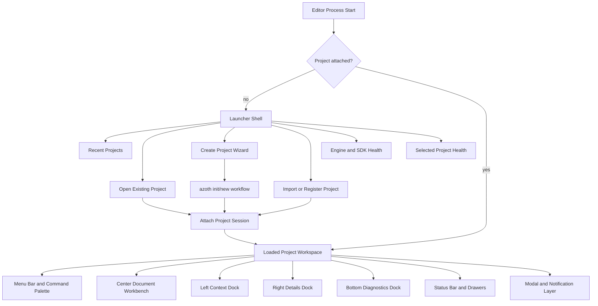

Rules:

- The launcher is for finding, creating, importing, repairing, and attaching
  projects.
- The launcher must not show loaded-editor docks such as asset browser,
  inspector, graph canvas, viewport, console, or session panels.
- The loaded editor must not use a project setup form as a default bottom panel.
- Opening an existing project is a file/directory selection flow. Git, LFS,
  gems, SDK state, and workflow health are read from the selected project,
  not entered as redundant launcher fields.

## Launcher Component Map

The launcher is a project browser and project-management surface. It is not a
small loaded editor and it should not expose editor docks.

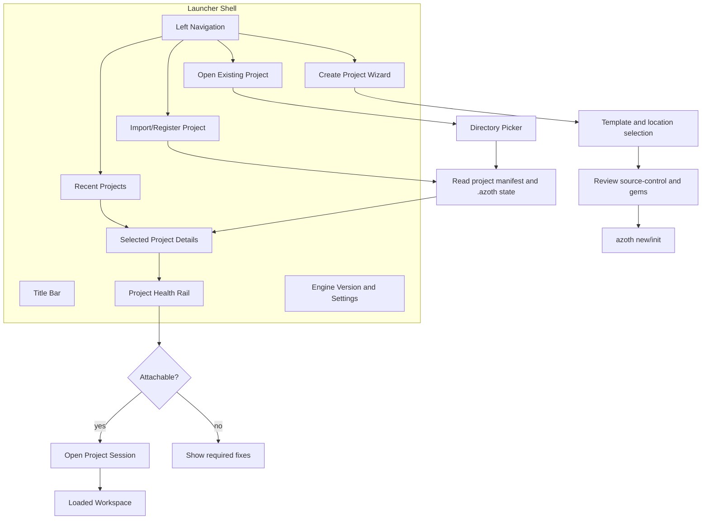

Launcher UX rules:

- Recent projects are navigable rows or tiles, not forms.
- Selecting a project shows details and health before opening.
- Open Existing starts with a directory picker. It does not ask for Git, LFS,
  gems, or package fields up front.
- Create Project is a guided wizard: identity, location, template, source
  control policy, review, create.
- Repair actions are explicit and explain what will change before they run.
- The launcher can show progress and errors for project creation/attach, but it
  does not show asset browser, viewport, graph canvas, inspector, console, or
  workspace session docks.

## Loaded Workspace Layout

The loaded editor shell should be content-first. The center is always an active
document or tool workbench. Docks support the active work; they are not the
primary workflow.

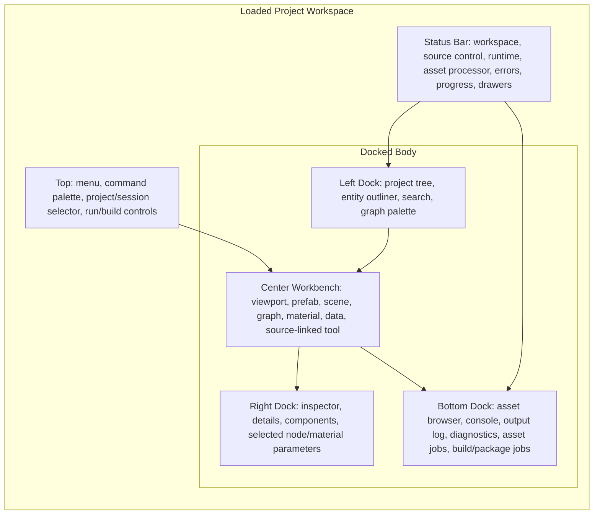

Default loaded-project layout:

- Center: project home, last opened level, or a level/prefab viewport when the
  project has an obvious startup asset.
- Left: authored/entity outliner.
- Right: inspector/details.
- Bottom: asset browser and console tabs, with output/jobs/diagnostics joining
  this dock as the workflow grows.
- Status: persistent project/session health, source control state, asset
  processor progress, runtime state, errors/warnings, and drawer buttons.

The current `ProjectWorkflowPanel` does not belong in the loaded workspace
default dock. It belongs in launcher/project management, project settings, or a
specific maintenance workflow.

The current `VisualGraphPanel` should not be a permanent default center tab. It
should open when the user creates or opens a graph-backed asset.

## Workspace Component Map

Loaded workspace components are placed by task role. A component should move
only when its role changes.

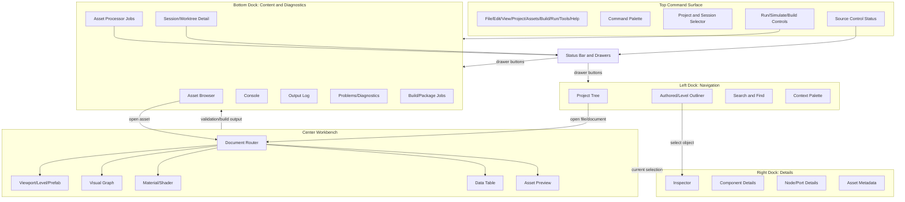

Workspace UX rules:

- Left dock answers "what scene/entity structure can I select?"
- Center answers "what am I editing?"
- Right dock answers "what is selected and editable?"
- Bottom dock answers "what content can I open, what happened, what is building, what failed?"
- Status bar answers "what is the current project/session/runtime state?"
- Menus and command palette execute commands; they do not duplicate entire
  workflow surfaces.

## Interaction Flows

Project open flow:

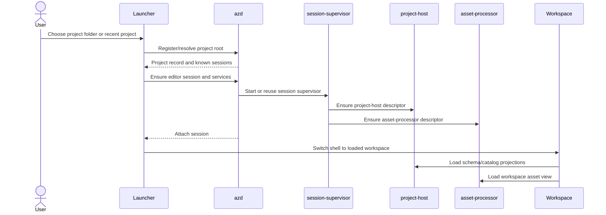

Asset open flow:

```mermaid
sequenceDiagram
    actor User
    participant Browser as Asset Browser
    participant Router as Document Router
    participant Registry as Workbench Registry
    participant Host as project-host
    participant Workbench as Center Workbench
    participant Details as Right Details Dock

    User->>Browser: Open asset/source document
    Browser->>Router: Asset identity and schema type
    Router->>Registry: Resolve document editor descriptor
    Registry-->>Router: Workbench descriptor
    Router->>Host: Load authoritative document snapshot
    Host-->>Router: Snapshot and edit capabilities
    Router->>Workbench: Open or focus editor tab
    Workbench->>Details: Publish current selection
```

Graph edit/build flow:

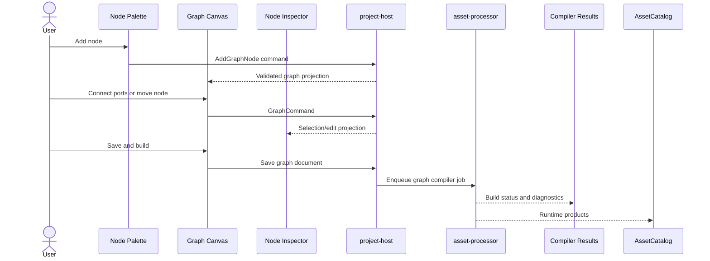

These flows keep mutable project truth inside project services. The editor
mutates user intent and presentation state; project-host validates document
commands and asset-processor produces runtime products.

## Workbench Model

Azoth should treat major editing experiences as workbenches registered by
engine/editor code or by project-host/tool-host descriptors. A workbench owns
its document editor, contextual panels, commands, and default layout.

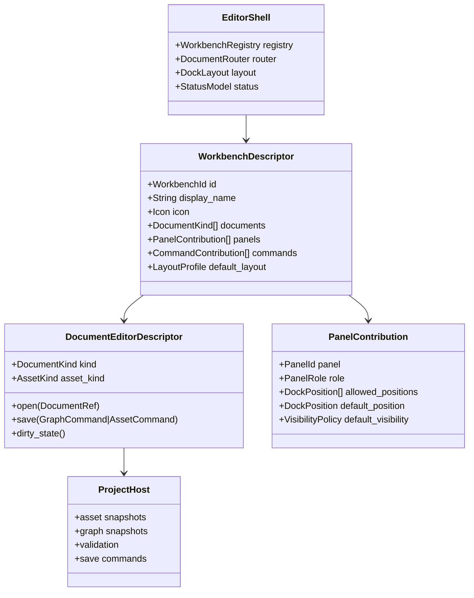

Workbench examples:

- Level/Prefab Workbench: viewport center, outliner left, inspector right,
  console/jobs bottom.
- Visual Graph Workbench: graph canvas center, node palette left, details right,
  compiler/results bottom.
- Material/Shader Workbench: material graph or property editor center, preview
  viewport center/split, palette left, parameters right, shader compile output
  bottom.
- Data Table Workbench: table/grid center, schema/properties right, validation
  results bottom.
- Asset Preview Workbench: model/texture/audio preview center, metadata/details
  right.

## Workbench Element Maps

Level/prefab workbench:

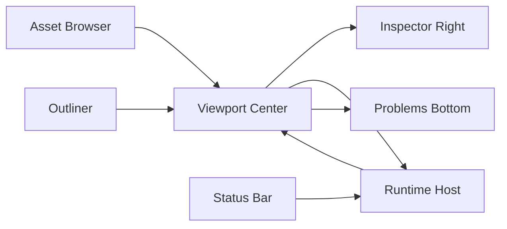

Visual graph workbench:

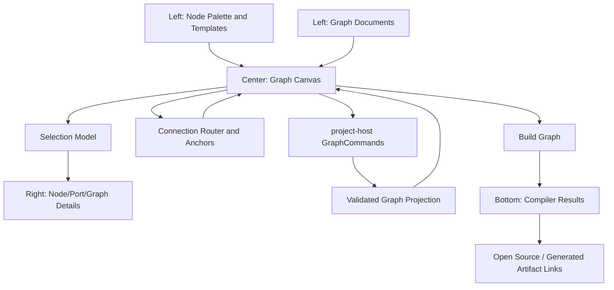

Material/shader workbench:

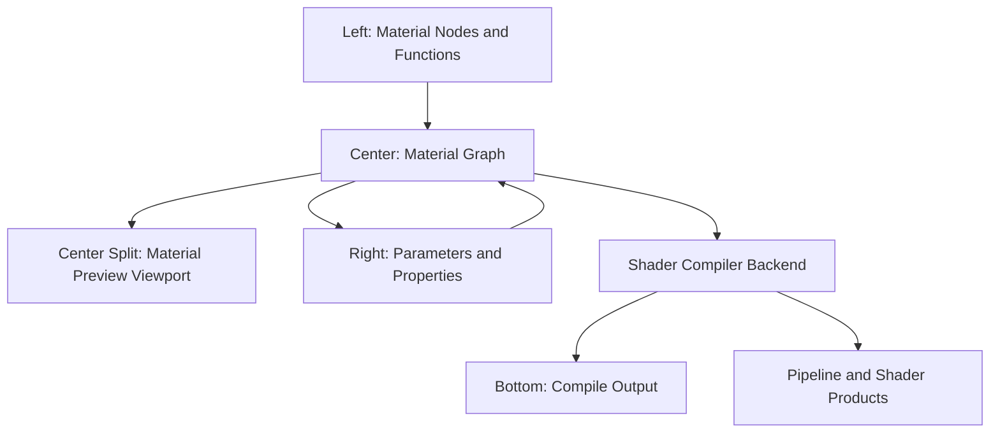

Data table workbench:

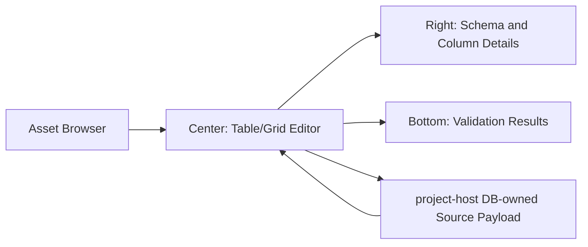

UX improvements implied by these maps:

- Graph/material palettes are contextual left surfaces, not global left docks.
- Compiler output is bottom diagnostics for the active document, not a separate
  always-open global console.
- Selection drives the right inspector uniformly across viewport, graph,
  material, data, and asset preview workbenches.
- Status bar drawer buttons should open high-volume surfaces on demand.
- Empty center states should offer the next concrete action: open level, create
  asset, open graph, or run project. They should not explain the whole editor.

## Service Boundary

The editor process owns presentation and interaction state. Project truth stays
behind services.

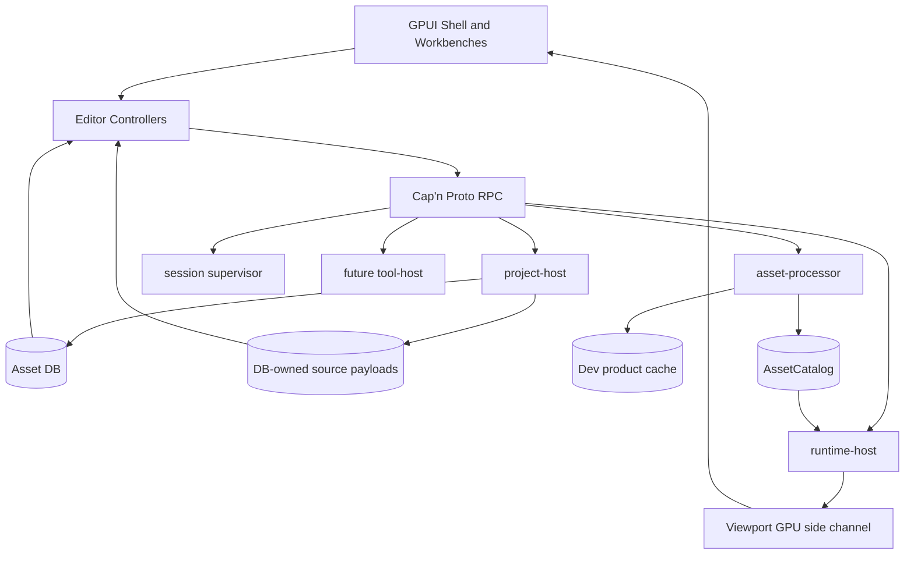

Rules:

- The editor does not load project or gem code into the editor process.
- Project/gem-specific tools are surfaced through service descriptors and
  generated schemas/protocols.
- Project-specific tools, crates, and assets remain project-owned and appear
  through project or gem registration, not engine UI hardcoding.
- DB-owned authored source is the project authority. The product cache and
  packaged output are build products.

## Graph And Node Editing

Graph editing is an asset workflow, not a global editor mode. The authoring
document is editable; runtime products are compiled.

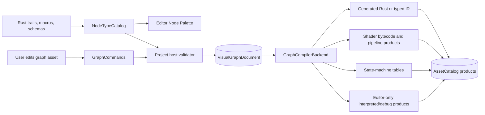

Hot graph categories must compile to domain-native products: generated Rust,
shader products, pipeline state, state-machine tables, or tightly packed typed
IR with resolved bindings. The node editor may use reflective metadata while
authoring, but gameplay, shader/material, animation, and other hot runtime
systems must not execute through editor metadata, Cap'n Proto messages, DB rows,
RON, or dynamic graph interpretation.

## Placement Rules

These are the rules to apply when adding any new editor UI:

- Project discovery, creation, import, repair, and initial health checks belong
  to the launcher/project manager.
- Active editing belongs to the center workbench.
- Structural scene/entity navigation belongs to the left dock.
- Content browsing belongs to the bottom dock with console/output workflows.
- Properties, selected-object details, and parameters belong to the right dock.
- Logs, diagnostics, compiler results, asset processor jobs, and package/build
  jobs belong to the bottom dock or status-bar drawers.
- Persistent low-noise state belongs to the status bar.
- Menus and command palette expose commands; they should not duplicate whole
  panels.
- Asset-specific editors own contextual palettes and inspectors; they should
  not become permanent global tabs.
- Project-specific UI reaches the editor through descriptors and project
  services, never by linking project code into the universal editor.
